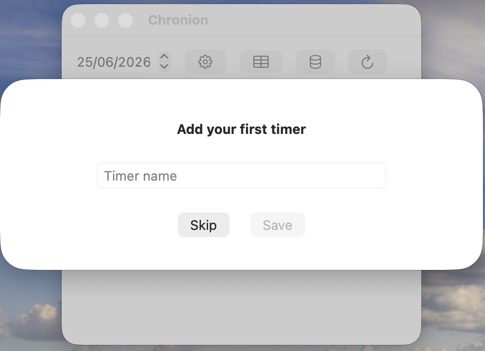
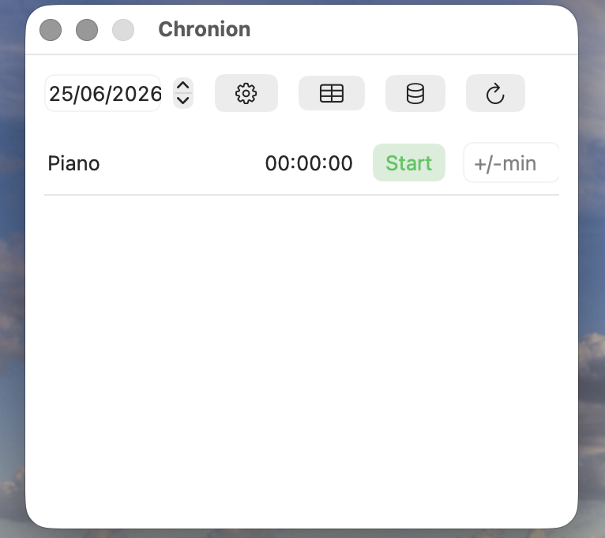
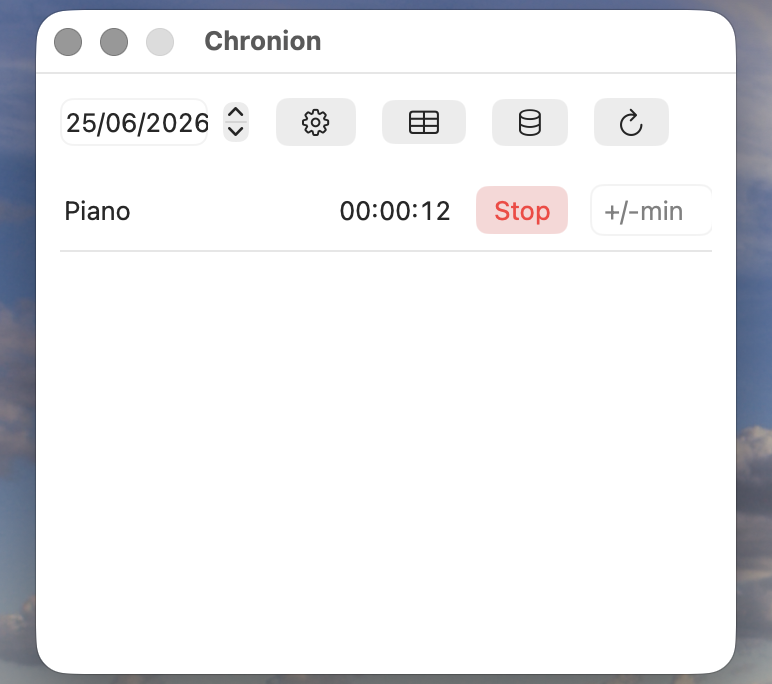
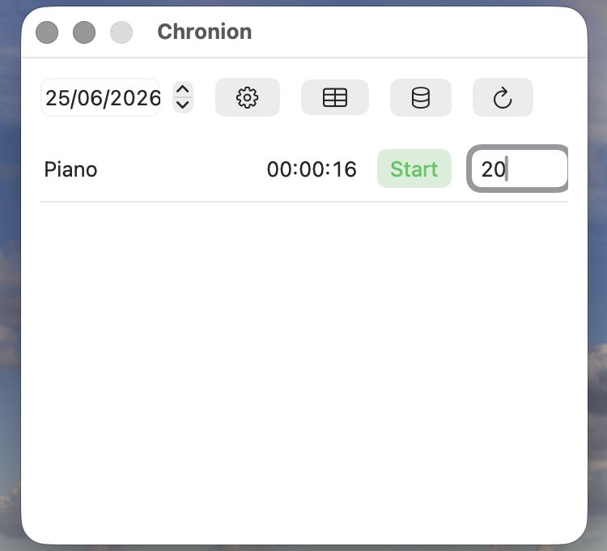
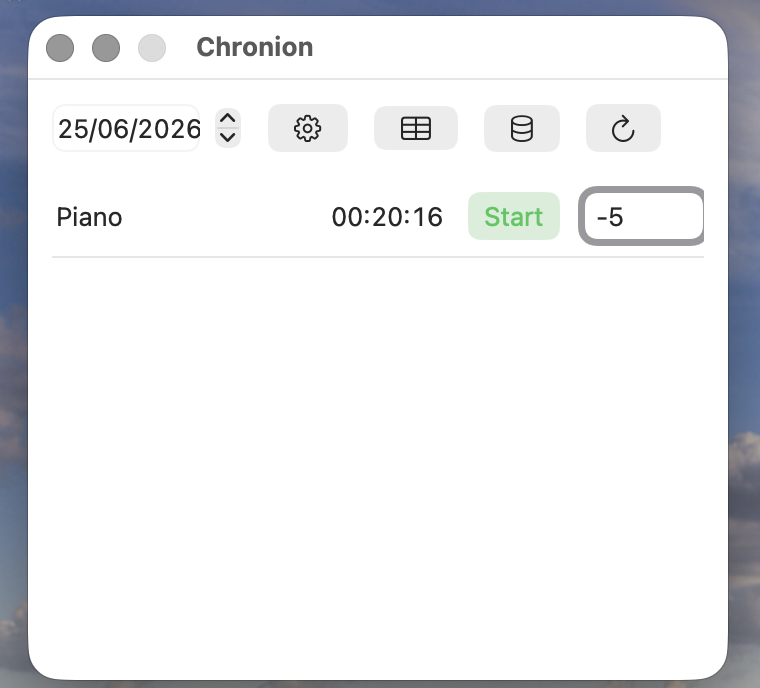
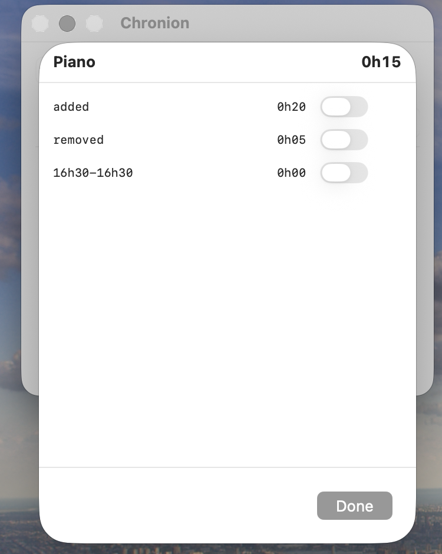
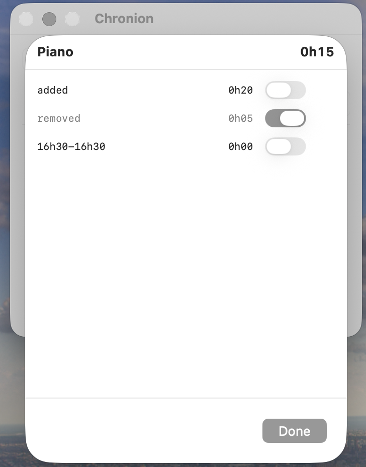
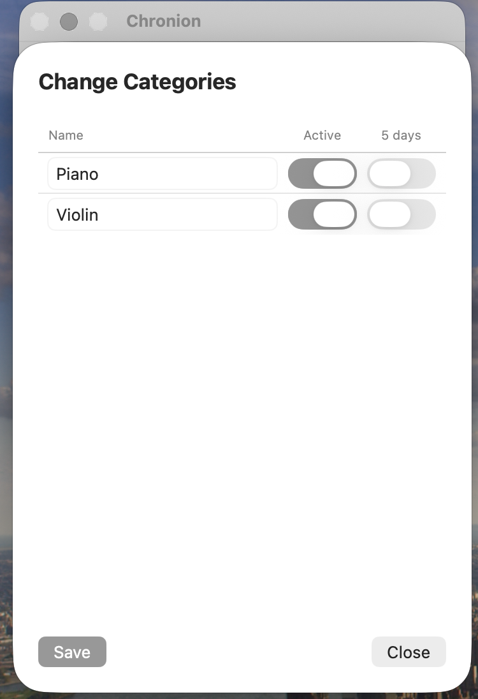

# Chronion

Chronion is a minimal time tracker for macOS. Track time across multiple categories, make manual adjustments, and review your sessions — all synced automatically via iCloud.

---

## Getting Started

When you first open Chronion, you'll be prompted to add your first timer category. Type a name and click **Save**, or click **Skip** to start without one.

You can add and manage categories at any time via the **Change Categories** screen.

---

## Tracking Time

The main window shows all your active categories for the selected day. Each row displays the category name, the total tracked time for that day, and two controls:

- **Start / Stop** — click **Start** (green) to begin tracking. The button turns red and shows **Stop** while the timer is running.
- **+/- min** — enter a positive number to add minutes, or a negative number to subtract them. Press Return to apply. This is useful when you forgot to start the timer, or tracked too much.

For running timers the button changes from **Start** to **Stop**

You can minutes if you forgot to start the timer.

And you can substract minutes if you forgot to stop it.

Use the date stepper in the top-left corner to navigate to any previous day and review or adjust its data.

---

## Session Detail

Click on a category row to open the session detail view. It shows each individual session for that day — tracked sessions with their time range, manually added time, and manual removals — along with the net total at the top.

You can **invalidate** any session by toggling it on. Invalidated sessions are shown with a strikethrough and excluded from the total. Toggle them back off to restore them.

---

## Managing Categories

Open **Change Categories** via the gear icon in the toolbar. Here you can:

- **Rename** a category by editing its name field
- **Activate / deactivate** a category with the **Active** toggle — inactive categories are hidden from the main view
- **5 days** toggle — when enabled, weekly averages in the stats view divide by 5 instead of 7 (useful for work-day categories)
- **Reorder** categories by dragging rows

Click **Save** to apply your changes.

---

## Toolbar

| Icon | Action |
|------|--------|
| Date stepper | Navigate between days |
| Gear | Change Categories |
| Grid | Weekly statistics |
| Database | iCloud sync status |
| Refresh | Reload data |

---

## iCloud Sync

Chronion syncs all sessions and categories via iCloud automatically. An internet connection is not required to track time — changes sync once connectivity is restored.

---

## Support

Found a bug or have a suggestion? [Open an issue on GitHub](https://github.com/marcobormann/chronion/issues).
